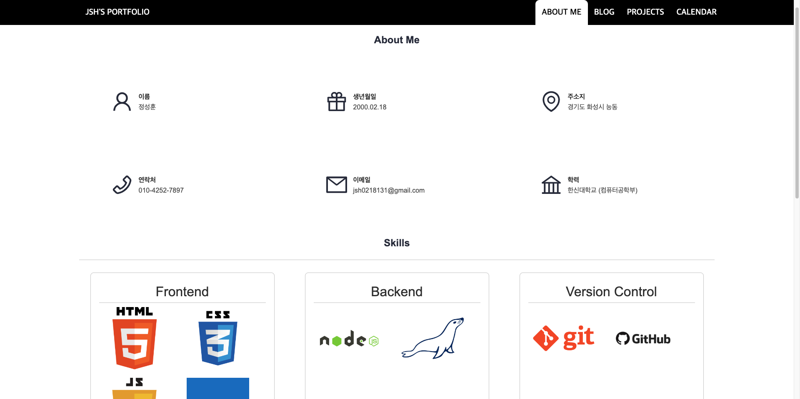
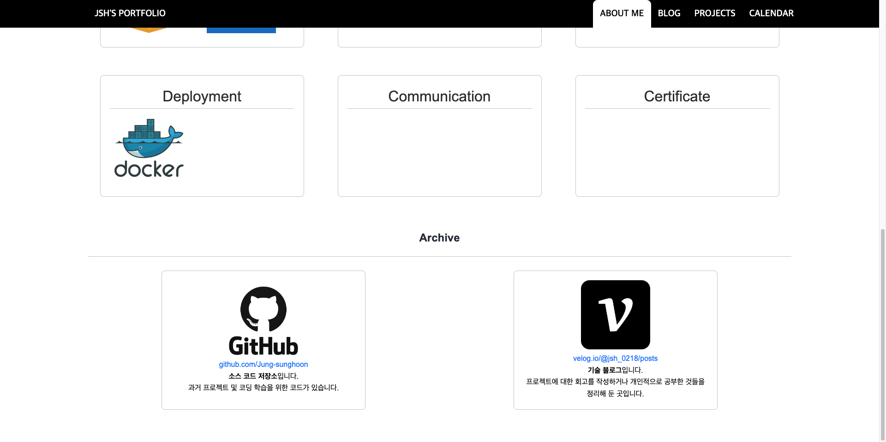
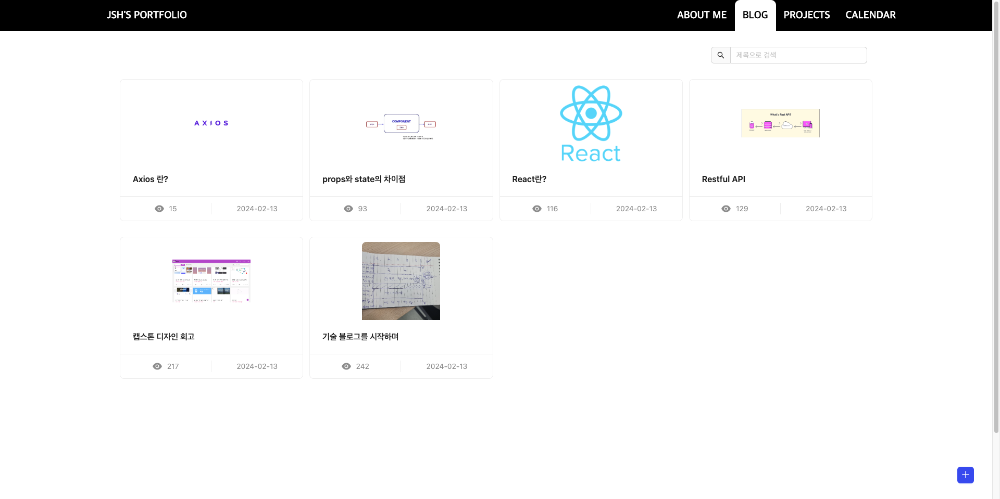
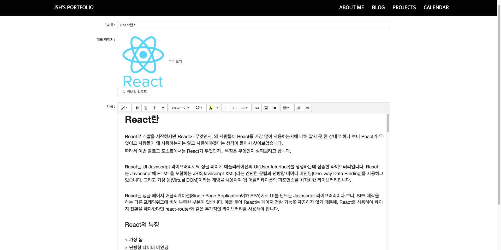
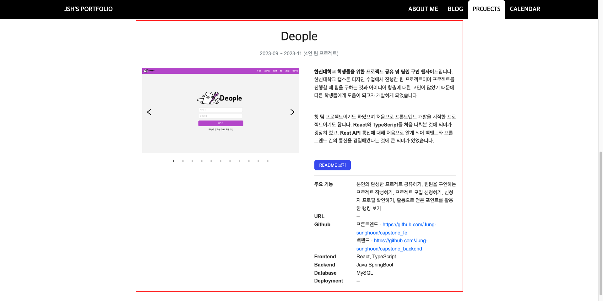
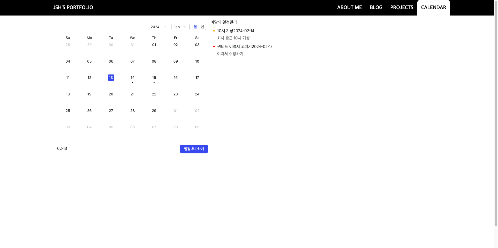
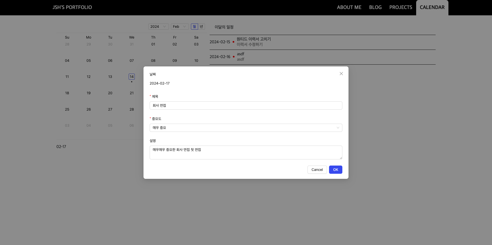
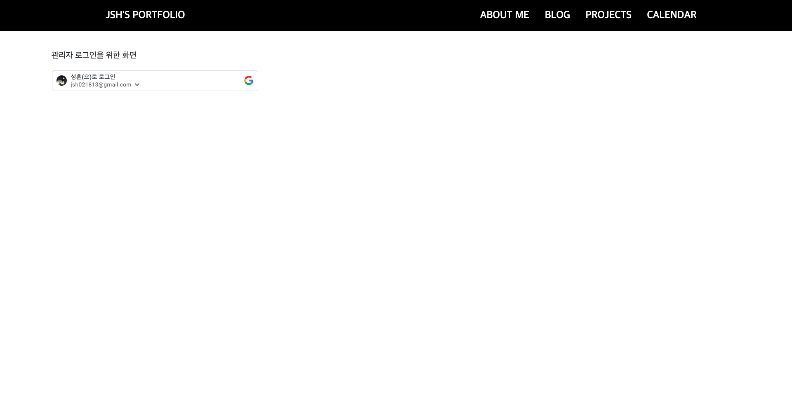

<h1>Portfolio</h1>
포트폴리오 웹 사이트입니다.
 
현재 PM2를 활용하여 배포 중입니다.
 
<a href='https://jung-sunghoon.github.io/' target="_blank">https://jung-sunghoon.github.io/</a>
 
프로젝트 후기는 이곳에서 확인하실 수 있습니다.
 
<a href = "https://jung-sunghoon.github.io/projects" target="_blank">https://jung-sunghoon.github.io/projects</a>

<h2>1. 기능 상세</h2>
<ol>
  <li>About Me 페이지</li>
  
  
  
저에 대해 소개하는 페이지입니다. 간단한 자기 소개, 인적 사항, 기술 스택이 적혀 있습니다.

   
  <li>Blog 페이지</li>
  
  
  
CRUD를 활용하여 자체 블로그를 운영 중입니다. 일반 사용자는 게시물을 보기만 할 수 있고, Admin 페이지를 통해 Google OAuth를 활용하여 사용자 인증을 한 후 게시물 생성, 수정, 삭제가 가능합니다. (현재 저만 가능합니다.)

   
  <li>Projects 페이지</li>
  
  
제가 해왔던 프로젝트를 설명하는 페이지입니다. 간단한 설명과 요약, 프로젝트를 마치고 난 후 느낀 점 등이 적혀있습니다.

   
  <li>Calendar 페이지</li>
  
  
  
일정관리 페이지입니다. 블로그와 마찬가지로 사용자 인증을 통해 일정 생성, 수정, 삭제가 가능합니다. (이 기능도 현재 저만 가능합니다.)

   
  <li>Admin 페이지</li>
  
  
Admin 페이지입니다. 블로그와 일정 관리를 할 수 있도록 오직 저만 로그인하기 위해 따로 만들어 둔 페이지입니다. Google OAuth 인증을 통해 DB의 제 정보와 대조하여 Admin 여부를 판단합니다.

</ol>
